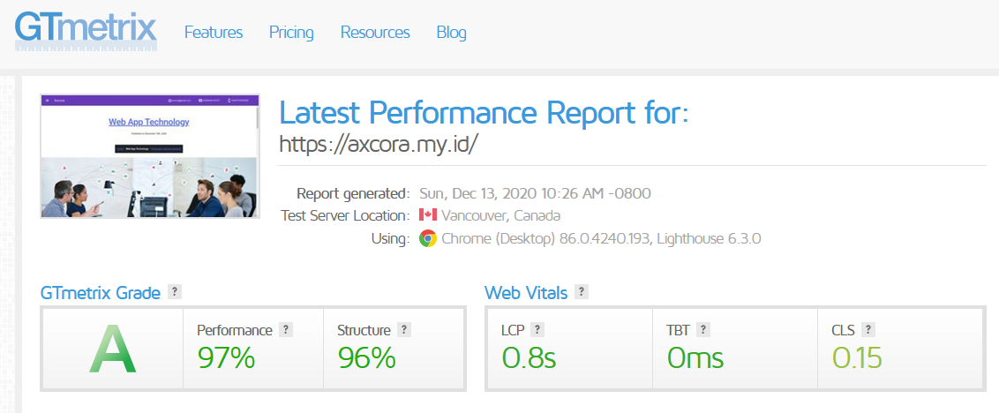

# New Modern CMS Build a website without database.

A new generation get simpe cms axcora tech for develope website project powerfull !!

No need a database for installation , make your website very fast and SEO friendly.

+ Company profile website themes, can be you customise with you needed.
+ Modern and fresh design using MDL and new bootstrap 5
+ Slider Menu Include
+ Simple and modern display

-----------------------------

Login Area for backend

Page and article post menu.

Create article post very simple and easy

Back end setting

Test Speed using company profile themes

 -----------------------------------------------------------------
### how to install

CLOUDS / SHARED HOSTING

Just download this file and upload on your shared or clouds host , upload on public_html fle if you using this cms for develope home page website, or you can upload it on sub directori .
After upload progress success. Your website is online now . for first need to configure site with accsess on backend - visit yourwebsite/admin - login with user : axcora / pass : axcoracms - then visit on setting change URL with yoursite, and save.

LOCALHOST

Need third party XAMPP WAMPP LAMPP server, download this project and upload on your xampp/htdocs folder,  for first need to configure site with accsess on backend - visit localhost/projectweb/admin - login with user : axcora / pass : axcoracms - then visit on setting change URL with yoursite example localhost/projectweb/admin, and save.

By default use username : axcora and password : axcoracms

 -----------------------------------------------------------------

Features :
+ Page for create new post article content you can edit and delete too.
+ File menu for upload media manager
+ Setting for change password and others.
+ SEO : automaticly generate meta title , description , facebook, twitter.

No need a database installation make your website very fast, and of course with SEO friendly include, simple and easy to use.

For demo : https://axcora.my.id

more info https://axcora.com/getaxcoracms

present by https://axcora.com

Hapy codding !!
